# Jenkins Maven Project Integration with GitHub

## Project Overview
This project focuses on integrating a Maven-based Java application into Jenkins using a GitHub repository.
The objective is to implement a Continuous Integration workflow where Jenkins automatically retrieves source code from GitHub and builds it using Maven. This project is a continuation of the previous steps where Jenkins was deployed and configured with essential tools.

## Technologies Used

- AWS EC2
- Jenkins
- Git & GitHub
- Maven
- Java
- Linux (Amazon Linux 2)

## Infrastructure Description
This project builds on a previously configured Jenkins environment with Java, Git, and Maven installed.
The main focus is on :
- Connecting Jenkins to a GitHub repository
- Importing a Maven project
- Automating the build process using Jenkins

## Implementation Steps

### 1. GitHub Repository Creation

- Created a new public GitHub repository
- Initialized with a README file
- Cloned the repository locally

### a. GitHub Setup

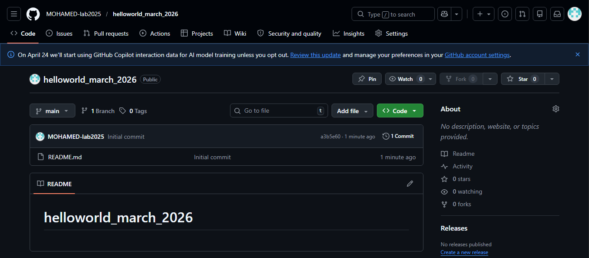

### 2. Project Setup (Local Environment)

- Created a working directory
- Cloned the GitHub repository
- Cloned an existing Maven project
- Copied project files into the main repository

### a. Local Setup

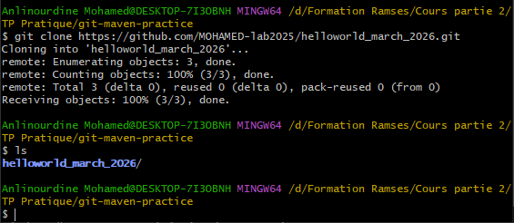

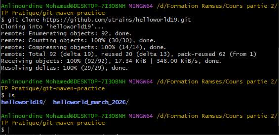

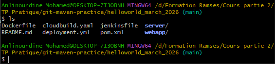

### 3. Version Control (Git)

- Added project files to Git
- Created initial commit
- Pushed code to GitHub repository

### a. Git Push

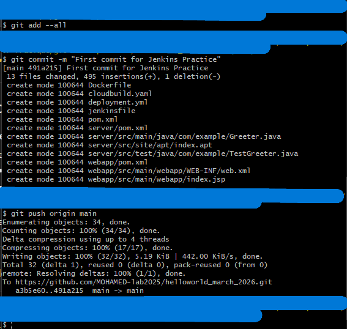

### 4. Jenkins Job Creation

- Created a new Jenkins Maven project
- Configured Git repository URL
- Set branch to `main`
- Configured Maven build goals (`clean install`)

### a. Jenkins Job Setup

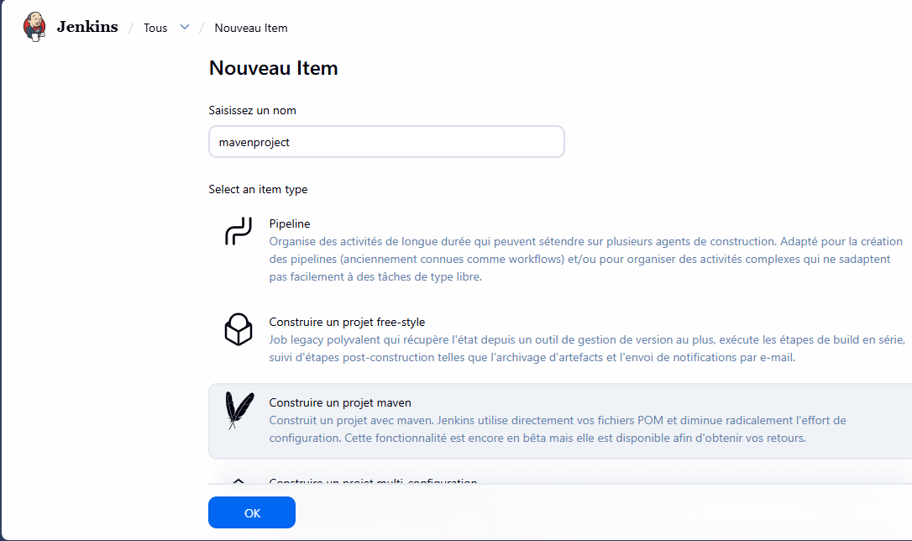

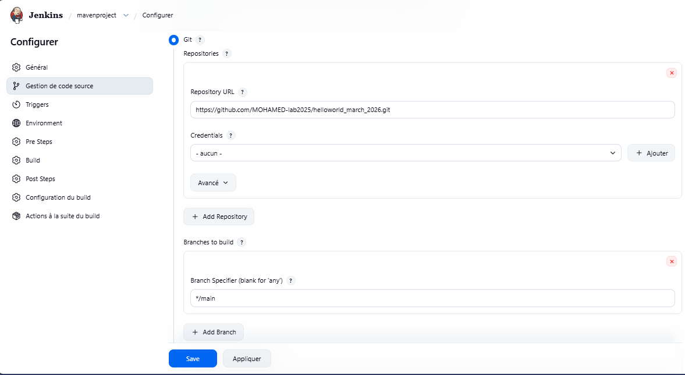

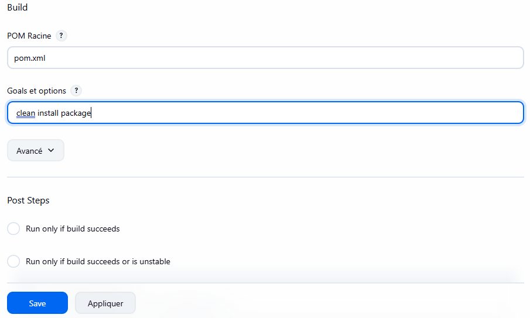

### 5. Build Execution

- Triggered build using **Build Now**
- Verified successful execution via Console Output

### a. Build Execution

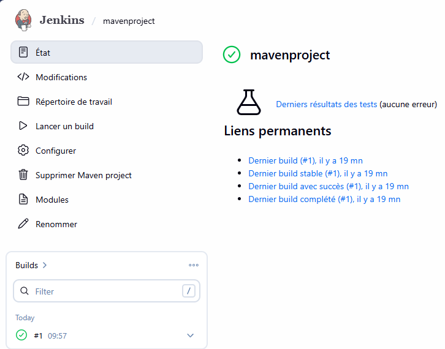

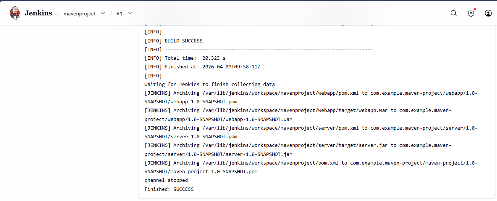

### 6. Workspace Verification

- Checked Jenkins workspace directory
- Verified project files were correctly cloned

### a. Workspace

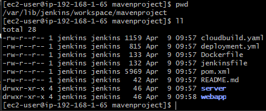

### 7. AMI Creation and Cleanup

- Created an AMI of the Jenkins server using Terraform
- Preserved environment configuration
- Destroyed infrastructure while keeping the AMI

### a. Terraform AMI

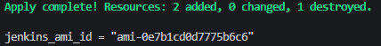

### b. Terraform Destroy

## Results

- GitHub repository successfully integrated with Jenkins
- Maven project built automatically using Jenkins
- CI workflow implemented
- Jenkins workspace verified
- AMI created for backup
- Infrastructure cleaned up properly

## Skills Demonstrated

- Git & GitHub workflow
- Jenkins job configuration
- Maven build automation
- Continuous Integration (CI)
- AWS environment usage
- Terraform basic operations
- Troubleshooting Jenkins builds

## Conclusion
This project demonstrates the implementation of a Continuous Integration pipeline using Jenkins, GitHub, and Maven. It highlights the ability to integrate source code management with automated build tools and validate application builds in a cloud environment.